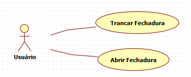

# Casos de uso

## 1. Diagrama de casos de uso

## 2. Especificação dos casos de uso

**Instruções do professor**: Para cada caso de uso, criar as tabelas com a especificação do caso de uso. Siga o exemplo dado abaixo:

### 2.1. Caso de uso **Abrir/Fechar fechadura**

| Campo          | Informação        |
|---|---|
| Identificador: | UC01              |
| Nome:          | Abrir/Fechar Fechadura |
| Atores:        | Usuário |
| Sumário:       | Realiza a abertura ou fechamento da fechadura |

| Fluxo Principal |
|---|
| 1) O usuário clica no botão |
| 2) O sistema usa a api para definir o status da fechadura                  |
| 3) Dependendo do status da fechadura o sistema toma a decisão de abrir ou fechar |
| 4) Realiza a abertura ou fechamento da fechadura eletrônica |

