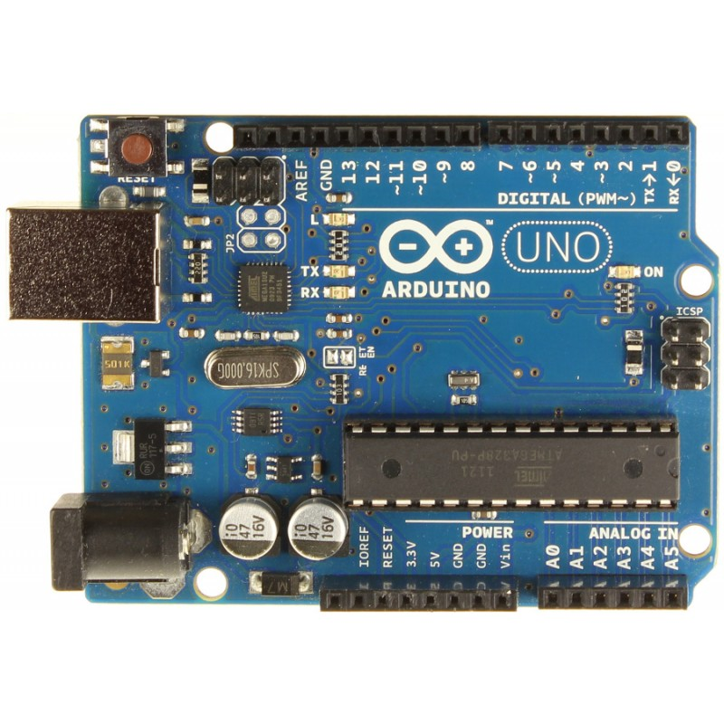
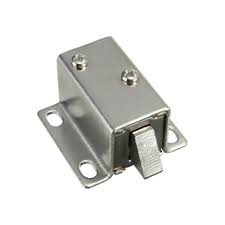
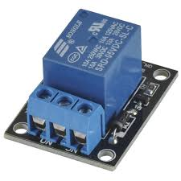
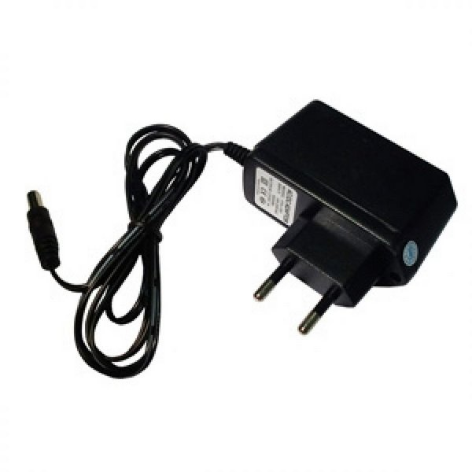
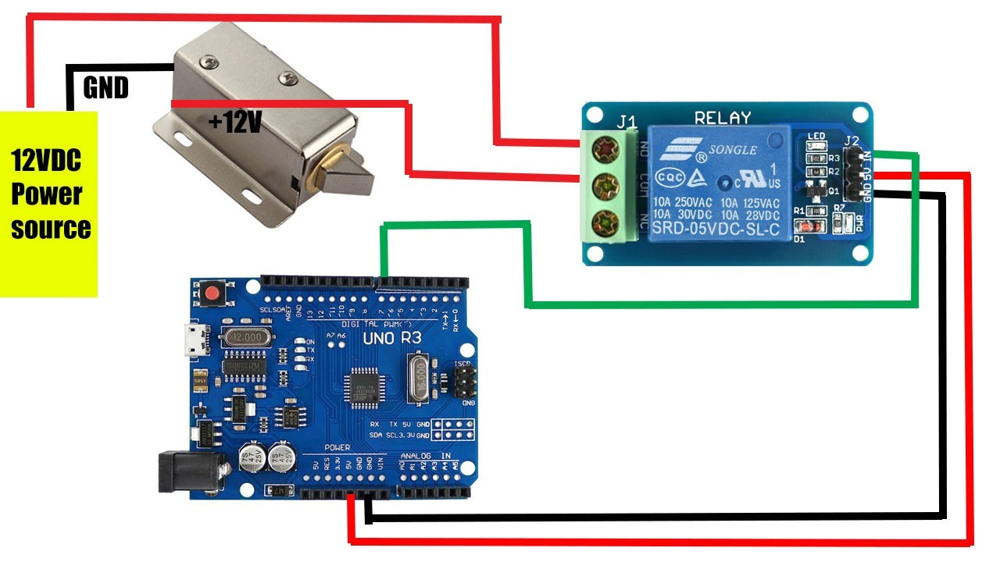

# Descriçao do Hardware

- **Lista de Peças**
    1. **Arduíno Uno** 

    

    2. **Fechadura Elétrica**

    

    3. **Relay**

    
    
    4. **Fonte 12v**
    
     
    

- **Desenho Tinkercad ou Fritzing**

     

