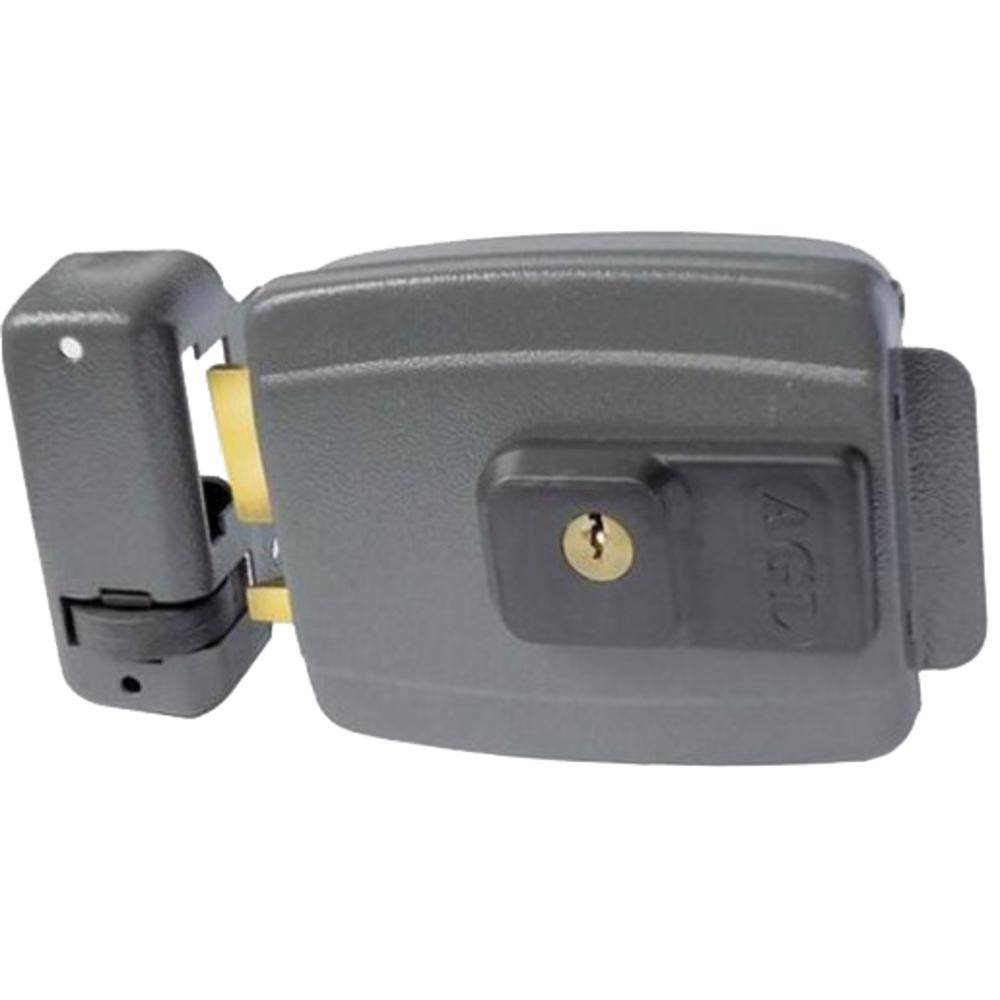
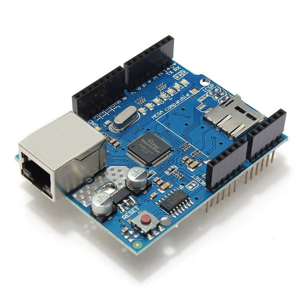

# Descriçao do Hardware

- **Lista de Peças**
    1. **Arduíno Uno** 

    

    2. **Fechadura Elétrica**

    

    3. **Ethernet Shield**

    

- **Desenho Tinkercad ou Fritzing**
- **Esquema eletrônico**
- **Materiais para confecção de caixas e consoles (ou arquivos para impressão 3D)**
