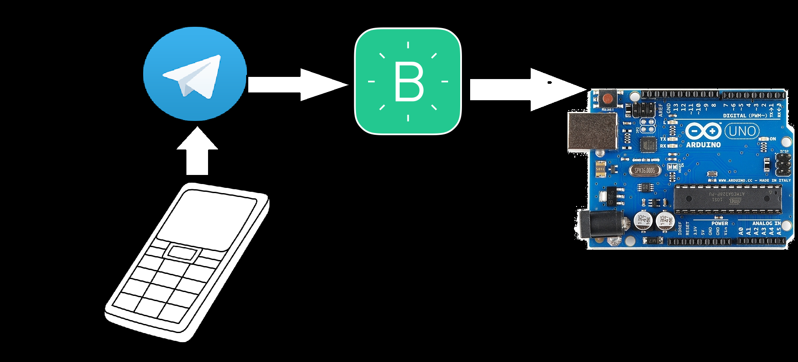

# Rede Unlock-me:
O projeto da trava eletrônica utiliza a rede (ethernet ou wi-fi)  da conexão usb do dispositivo conectado no arduino (Notebook. CPU, etc) para comunicação com a api do telegram através de um script python que envia a mensagem no protocolo http para o endpoint do Blynk, e com sua resposta ele abre ou fecha a trava Solenóide, conectada ao arduíno.

